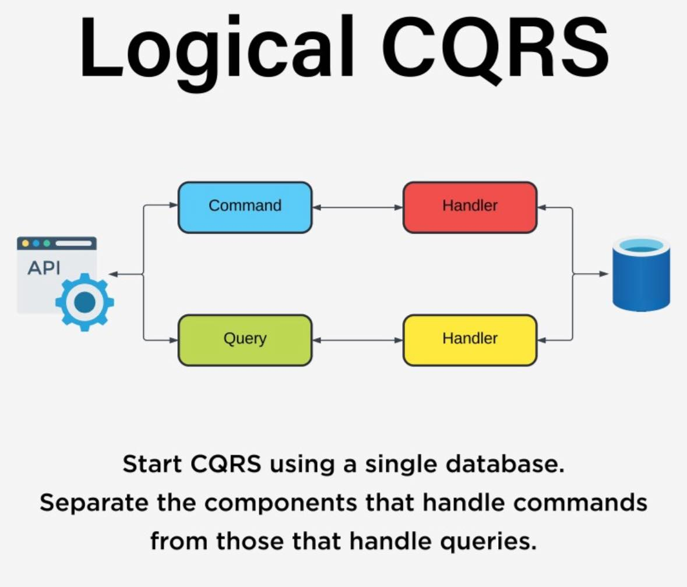
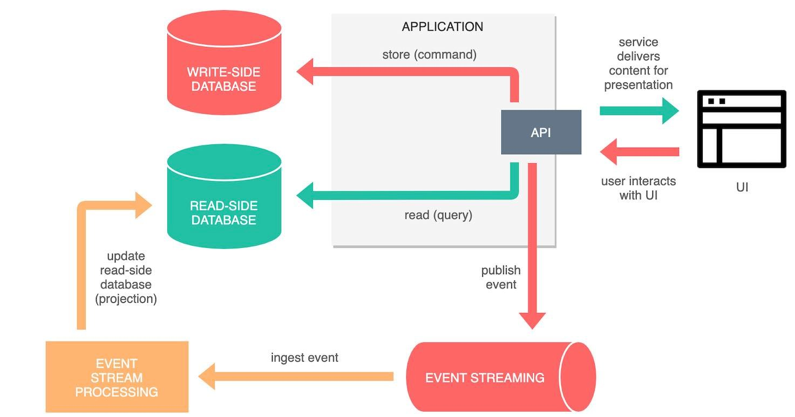
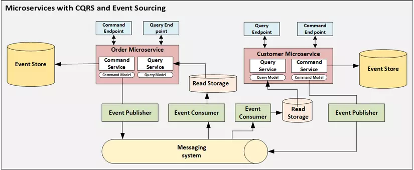

# 📘 CQRS (Command Query Responsibility Segregation)

CQRS (Command Query Responsibility Segregation) là một mẫu kiến trúc giúp **tách biệt rõ ràng giữa phần đọc dữ liệu (Query)** và **ghi dữ liệu (Command)** trong ứng dụng. Điều này giúp cải thiện hiệu năng, khả năng mở rộng và tính bảo trì của hệ thống.

---

## 📌 1. Tổng Quan

* **Command** : Ghi dữ liệu (Insert, Update, Delete)
* **Query** : Đọc dữ liệu (SELECT)

> Tách biệt để dễ tối ưu hóa từng phần cho mục tiêu khác nhau.



## ⚙️ 2. Kiến Trúc CQRS

```
[Client]
   │
   ├──> [Command API] ──> [Command Handler] ──> [Write DB]
   │
   └──> [Query API] ────> [Query Handler] ───> [Read DB]
```

* **Write DB** có thể là một schema hoặc hệ thống riêng biệt.
* **Read DB** có thể được tối ưu hóa cho hiệu suất truy vấn.

---

## ✅ 3. Ưu Điểm

* 🔄 Tách biệt rõ ràng xử lý đọc và ghi
* 🚀 Tối ưu hiệu năng đọc/ghi độc lập
* 🔧 Dễ mở rộng, dễ scale từng phần
* 🔐 Tăng cường bảo mật và kiểm soát

---

## ⚠️ 4. Nhược Điểm

* 🧩 Tăng độ phức tạp hệ thống
* 🔄 Cần đồng bộ giữa Read DB và Write DB (eventual consistency)
* 🧪 Phức tạp hơn khi test và debug

---

## 🛠️ 5. Khi Nào Dùng CQRS?

| Tình huống                                        | Có nên dùng CQRS?  |
| --------------------------------------------------- | --------------------- |
| Hệ thống đơn giản                              | ❌ Không cần thiết |
| Ứng dụng có nhiều đọc hơn ghi                | ✅ Phù hợp          |
| Yêu cầu hiệu năng cao                           | ✅ Nên dùng         |
| Dữ liệu phức tạp và thay đổi thường xuyên | ✅ Rất phù hợp     |

---

## 🔁 6. So Sánh Với CRUD

| Tiêu chí          | CRUD | CQRS |
| ------------------- | ---- | ---- |
| Gộp chung xử lý  | ✅   | ❌   |
| Tách biệt xử lý | ❌   | ✅   |
| Đơn giản         | ✅   | ❌   |
| Hiệu năng cao     | ❌   | ✅   |

---

## 🔄 7. Kết Hợp Với Event Sourcing

CQRS thường được kết hợp với **Event Sourcing** để lưu trữ toàn bộ các sự kiện xảy ra thay vì trạng thái hiện tại. Điều này giúp:

* Khôi phục lại dữ liệu ở bất kỳ thời điểm nào
* Audit dễ dàng





## 📚 Tài Liệu Tham Khảo

* [Martin Fowler on CQRS](https://martinfowler.com/bliki/CQRS.html)
* [Microsoft CQRS Docs](https://docs.microsoft.com/en-us/azure/architecture/patterns/cqrs)
* [EventStore CQRS](https://eventstore.com/cqrs/)

---

> 🧠 *CQRS là công cụ mạnh mẽ, nhưng không phải lúc nào cũng cần thiết. Hãy cân nhắc kỹ trước khi áp dụng.*
>
